# DSGram

## 👥 Miembros del Equipo
| Nombre y Apellidos | Correo URJC | Usuario GitHub |
|:--- |:--- |:--- |
| Jaime Torroba Martínez | j.torroba.2023@alumnos.urjc.es | JaTorroba |
| Isidoro Pérez Rivera | i.perezr.2023@alumnos.urjc.es | Isiperezz |
| Pablo Ruiz Uroz | p.ruizu.2023@alumnos.urjc.es | pruizz |
| Hugo Capa Mora | h.capa.2023@alumnos.urjc.es | huugooocm |

---

## 🎭 **Preparación 1: Definición del Proyecto**

### **Descripción del Tema**
Red social de resolución de ejercicios de Estructuras de Datos donde los usuarios permiten interacturar y elegir la Estructura que consideren para resolver un ejercicio, creando la Estructura en tiempo real mediante un visualizador. 
La aplicación se ubica en sector educativo y social. Permite a los usuarios aprender a utilizar estructuras de datos para la resolución de casos de uso, aportándole una herramienta para potenciar su capacidad de identificación de uso de estas en problemas reales propuestos por otros usuarios.

### **Entidades**
Indicar las entidades principales que gestionará la aplicación y las relaciones entre ellas:

1. **Usuario**
2. **Ejercicio**
3. **Lista de ejercicios**
4. **Comentario**
5. **Solución**


**Relaciones entre entidades:**
- Usuario - Ejercicio: Un usuario puede resolver múltiples ejercicios. Un ejercicio puede ser solucionado por múltiples usuarios (N:M).
- Usuario - Lista de ejercicios: un usuario puede tener múltiples listas de ejercicios (1:N).
- Lista de ejercicios - Ejercicio: una lista de ejercicios puede tener múltiples ejercicios (1:N).
- Ejercicio - Solución: un ejercicio puede tener múltiples soluciones de distintos usuarios (1:N).
- Solución - Comentario: una solución a un ejercicio puede tener múltiples comentarios (1:N).
- Usuario - Usuario: un usuario puede seguir a uno o muchos usuarios y puede ser seguido por uno o muchos usuarios (N:M).
- Usuario - Comentario: un usuario puede hacer múltiples comentarios en una solución a un ejercicio (1:N).
  
### **Permisos de los Usuarios**
Describir los permisos de cada tipo de usuario e indicar de qué entidades es dueño:

* **Usuario Anónimo**: 
  - Permisos: Visualización de ejercicios.
  - No es dueño de ninguna entidad.

* **Usuario Registrado**: 
  - Permisos: Gestión de su perfil, crear y editar listas de ejercicios suyas, resolver ejercicios, comentar en soluciones a ejercicios, seguir a otro usuario, crear un ejercicio.
  - Es dueño de: Sus listas de ejercicios y ejercicios creados, comentarios realizados en otras soluciones y soluciones realizadas por él.

* **Administrador**: 
  - Permisos: Gestión de todos los usuarios, listas de ejercicios, ejercicios, soluciones y comentarios de todo el sistema.
  - Es dueño de: Cuentas de usuario, listas de ejercicios, ejercicios, soluciones y comentarios de todo el sistema; puede gestionar toda la información del sistema, a excepción de datos personales de los usuarios.

### **Imágenes**
Indicar qué entidades tendrán asociadas una o varias imágenes:

- **Usuario**: Una imagen de avatar por usuario.
- **Solución**: Una imagen en la solución de la Estructura de Datos que ha sido construida por el usuario.

### **Gráficos**
Indicar qué información se mostrará usando gráficos y de qué tipo serán:

- **Gráfico 1**: gráfico de barras de comparación de número de seguidores con número de seguidos.
- **Gráfico 2**: gráfico de progresión del número de seguidores a lo largo del tiempo.


### **Tecnología Complementaria**
Se podrá exportar un ejercicio a PDF y se utilizará una librería externa (CytoscapeJS) para el visualizador de artefactos. Se autentificará los permisos de los usuarios con OAuth2 o JWT.

- Exportación a PDFs de los ejercicios con iText o similar.
- Visualización de artefactos para la creación de Estructuras de Datos con CytoscapeJS o similar.
- Sistema de autenticación OAuth2 o JWT.

### **Algoritmo o Consulta Avanzada**
Indicar cuál será el algoritmo o consulta avanzada que se implementará:

- **Algoritmo/Consulta**: Sistema de recomendaciones de seguimiento a otros usuarios en base a las personas que uno ya sigue.
- **Descripción**: Buscar sugerencias de seguimiento a partir de seguidores de seguidores.
- **Alternativa**: Priorizar el feed  de publicaciones por el contenido de los ejercicios de las listas que referencian en vez de orden cronológico.

---

## 🛠 **Preparación 2: Maquetación de páginas con HTML y CSS**

### **Vídeo de Demostración**
📹 https://youtu.be/GWdQl1jbLx8
> Vídeo mostrando las principales funcionalidades de la aplicación web.

### **Diagrama de Navegación**
Diagrama que muestra cómo se navega entre las diferentes páginas de la aplicación:

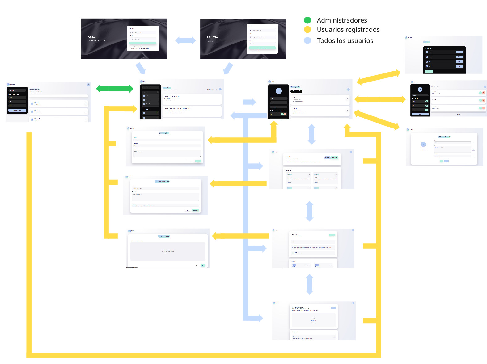

### **Capturas de Pantalla y Descripción de Páginas**

#### **1. Página Principal / Home**
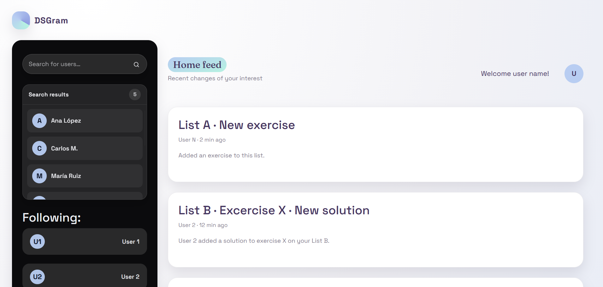
> Página de inicio que muestra publicaciones recientes que refieren a contenido nuevo o modificado en listas de usuarios seguidos, ejercicios o soluciones suyas. También se mostrarán algunos de los usuarios seguidos, así como una barra de búsqueda para poder encontrar nuevos usuarios que seguir. 

#### **2. Página de inicio de sesión / Log In**
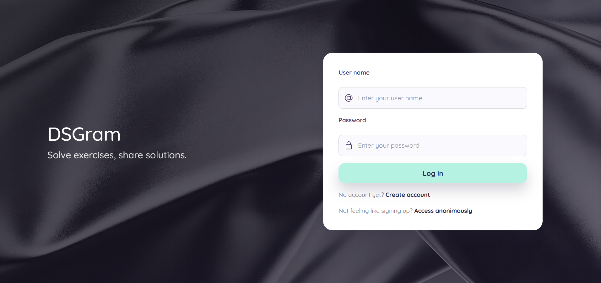
> Página que se muestra para acceder a la aplicación en la que el usuario podrá iniciar sesión o acceder de manera anónima.

#### **3. Página de Registro de usuario / Sign up**
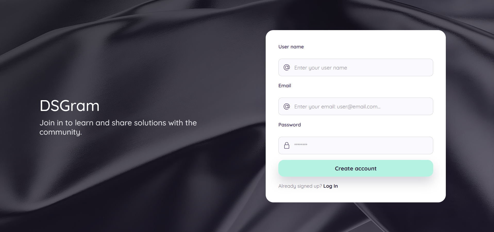
> Página en la que un usuario no registrado podrá darse de alta con su correo, nombre de usuario y contraseña y podrá acceder a la aplicación tras hacerlo.

#### **4. Página del perfil de usuario / Profile**

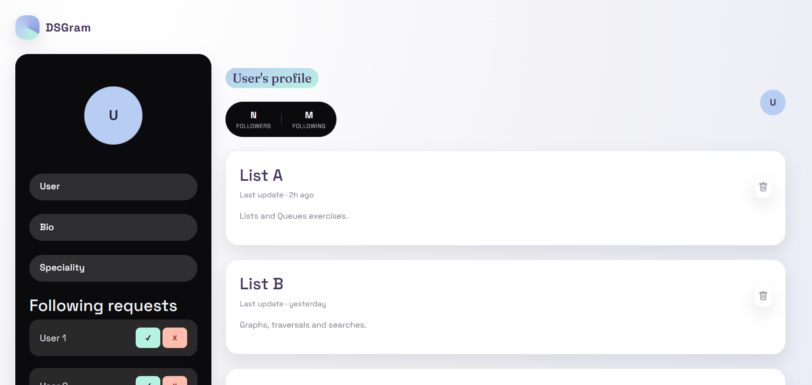
> Página del perfil de usuario que muestra sus datos de la aplicación, sus solicitudes recientes, número de seguidos, seguidores y las listas que tiene subidas. Permite el acceso a editar perfil y cerrar sesión desde un menú que se despliega en la foto de perfil.

#### **5. Página de seguidores / Followers**

> Página que muestra los seguidores de un usuario determinado, permite mostrar más para ver la totalidad de usuarios que le siguen.

#### **6. Página de solicitudes de seguimiento  / Follow-requests**

> Página para visualizar la totalidad de solicitudes de seguimiento que tiene un usuario para que pueda aceptarlas o rechazarlas.

#### **7. Página de Lista  / List-view**

> Página en la que se podrán encontrar todos los ejercicios de la lista de un usuario

#### **8. Página de ejercicio / Exercise**
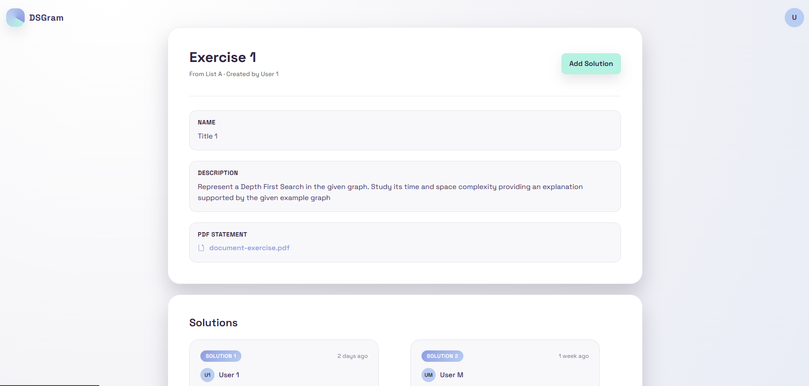
> Página en la que se encontrará el enunciado de un ejercicio y las soluciones de otros usuarios a este.

#### **9. Página de solución / Solution**

> Página en la que se encontrará la solución de un usuario a un ejercicio y los comentarios de otros usuarios a esta. Los usuarios registrados podrán añadir comentarios.


#### **10. Página de creación de una nueva lista/ New-list**
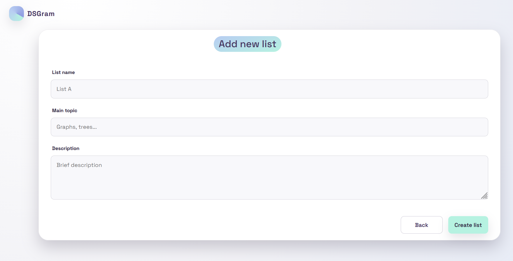
> Página de creación de una nueva lista de ejercicios que serán publicadas por un usuario en la aplicación. Se podra añadir titulo, descripción, y tipo principal de ejercicios.

#### **. 11 Página de creación de un nuevo ejercicio/ New-exercise**

> Página de creación de una nuevo ejercicio que formara parte de una lista creada previamente.Cada ejercicicio podra contener nombre, descripción y un pdf adjunto con el enunciado detallado si existiera.

#### **. 12 Página de creación de una nueva solución/ New-Solution**
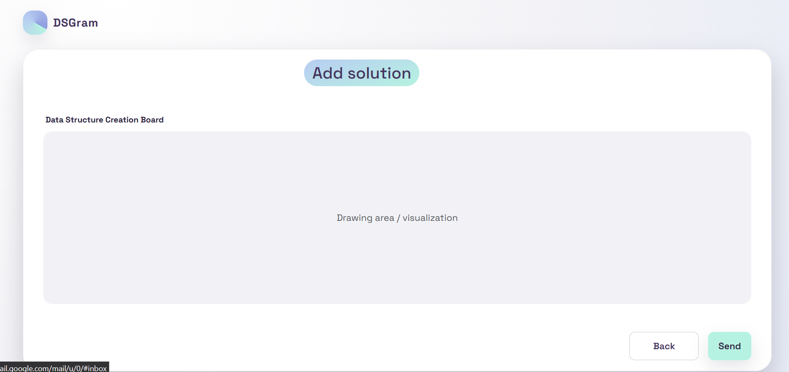
> Página de creación de una nueva solución creada para uno de los ejercicios publicados de una lista.Se podrá hacer uso del visualizador para crear la solución. 

#### **13. Página panel de administrador  / Admin panel**
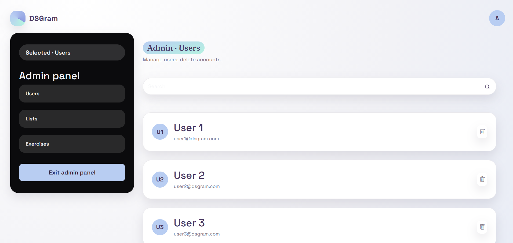
> Página para que el usuario administrador pueda visualizar el panel que tiene para poder ejecutar sus poderes especiales, como borrar usuarios, listas y ejercicios.

#### **14. Página de editar perfil  / Edit profile**

> Página para que el usuario pueda editar sus datos de nombre, descripción, especialidad y foto de perfil.


---

## 🛠 **Práctica 1: Web con HTML generado en servidor y AJAX**

### **Vídeo de Demostración**
📹 **[Enlace al vídeo en YouTube](https://www.youtube.com/watch?v=x91MPoITQ3I)**
> Vídeo mostrando las principales funcionalidades de la aplicación web.

### **Navegación y Capturas de Pantalla**

#### **Diagrama de Navegación**

Mientras que la apariencia de las pantallas ha cambiado, el flujo de navegación sigue siendo el mismo que el especificado en el anterior diagrama, a excepción de nuevas opciones para administradores que pueden dirigirse a las páginas de detalle de las entidades que gestionan desde el panel de administración. Además, dependiendo del flujo de ejecución y peticiones del usuario se mostrará una información u otra en cada una de las páginas del diagrama p.ej. mostrar el perfil propio o el de otro usuario; sin embargo la navegación entre páginas no se ve alterada.


#### **Capturas de Pantalla Actualizadas**

#### **1. Página Principal**

> Página de inicio que muestra publicaciones recientes que refieren a contenido nuevo o modificado en listas de usuarios seguidos, ejercicios o soluciones suyas. También se mostrarán algunos de los usuarios sugeridos, así como una barra de búsqueda para poder encontrar nuevos usuarios que seguir. 

#### **2. Página de inicio de sesión / Log In**

> Página que se muestra para acceder a la aplicación en la que el usuario podrá iniciar sesión con correo en la aplicación, cuenta de Google, cuenta de Github o acceder de manera anónima.

#### **3. Página de Registro de usuario / Sign up**

> Página en la que un usuario no registrado podrá darse de alta con su correo, nombre de usuario y contraseña y podrá acceder a la aplicación tras hacerlo.

#### **4. Página Principal Anónima / Anonymous Home**
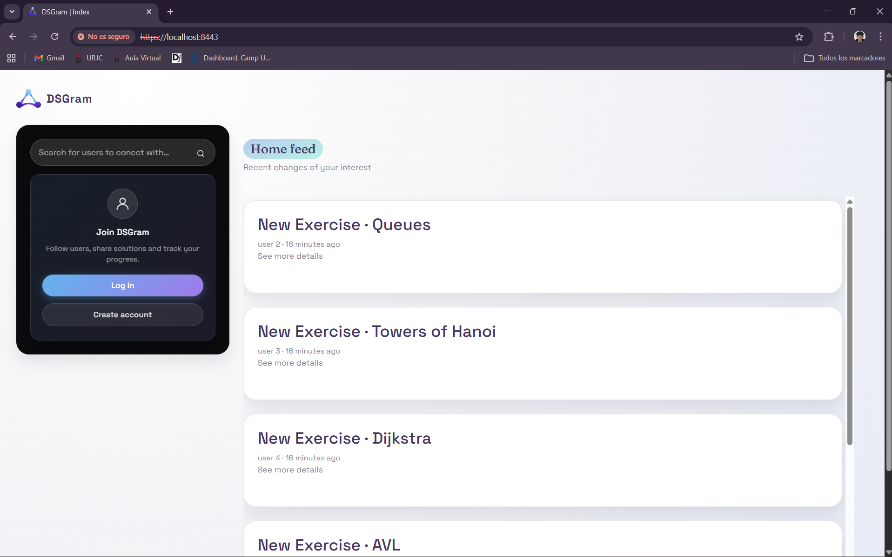
> Vista de la página principal orientada a usuarios no registrados, permitiendo explorar parte de la plataforma antes de iniciar sesión.

#### **5. Vista Anónima / Anonymous View**
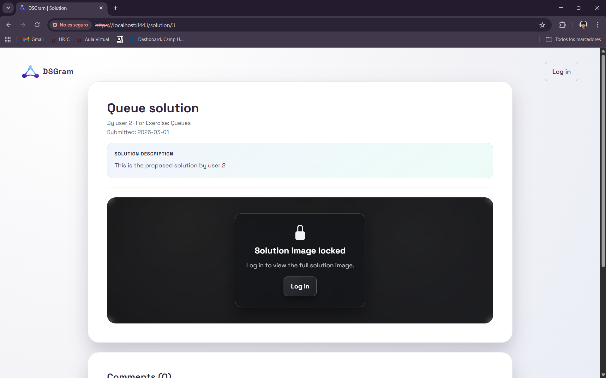
> Interfaz que muestra contenido privado a los usuarios que navegan por la aplicación sin tener una cuenta activa.

#### **6. Perfil de Usuario / Profile**

> Página personal del usuario donde se muestra su información, biografía, contadores de seguidores/seguidos y las listas de ejercicios que ha creado.

#### **7. Seguidores / Followers**
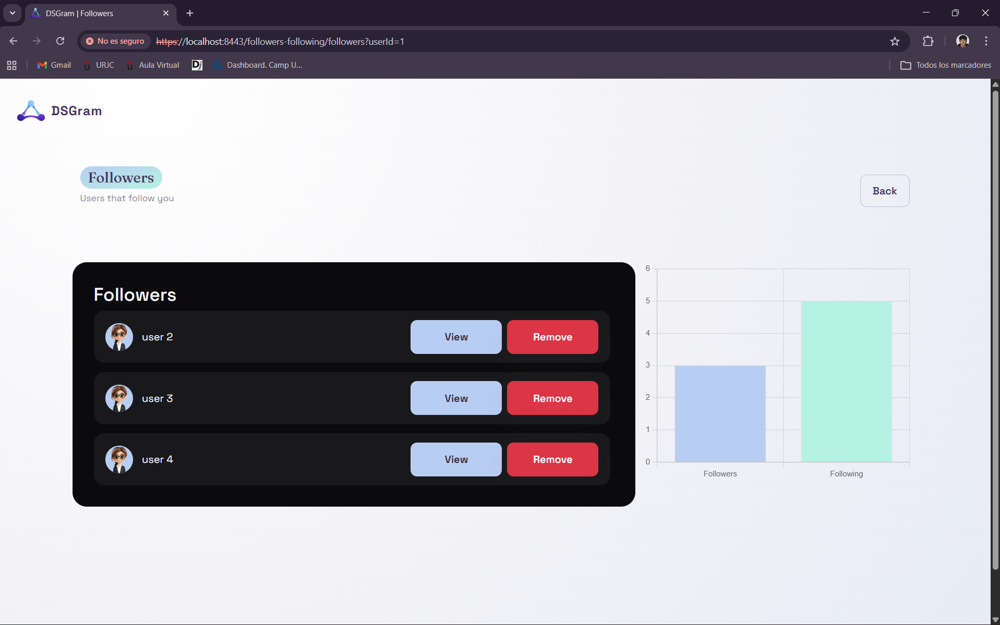
> Listado completo de todos los usuarios que siguen a la cuenta actual, permitiendo gestionar la comunidad.

#### **8. Seguidos / Following**
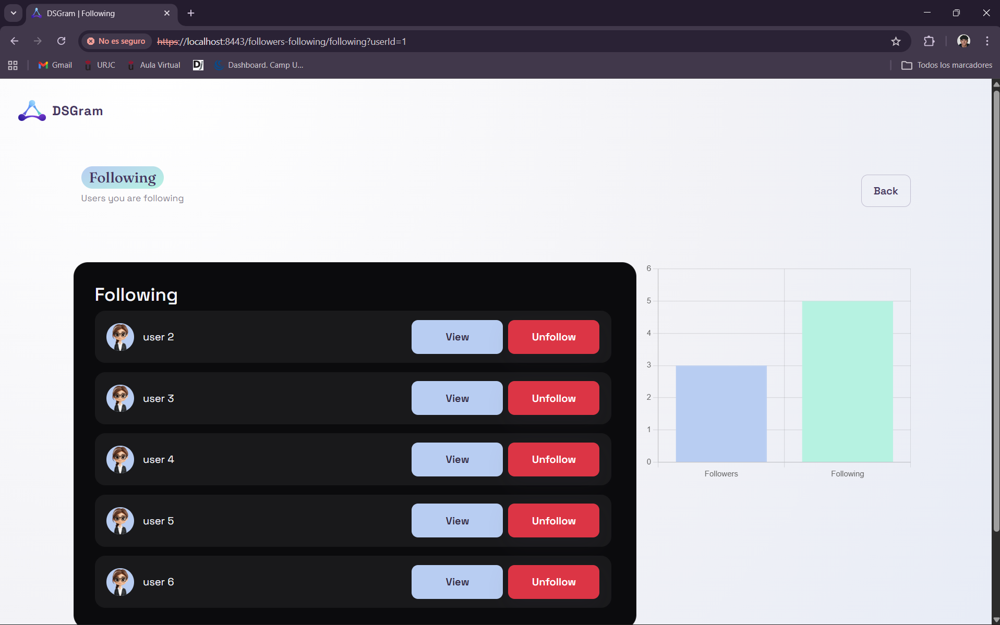
> Listado de todas las cuentas a las que el usuario actual está siguiendo en la plataforma.

#### **9. Solicitudes de Seguimiento / Follow Requests**
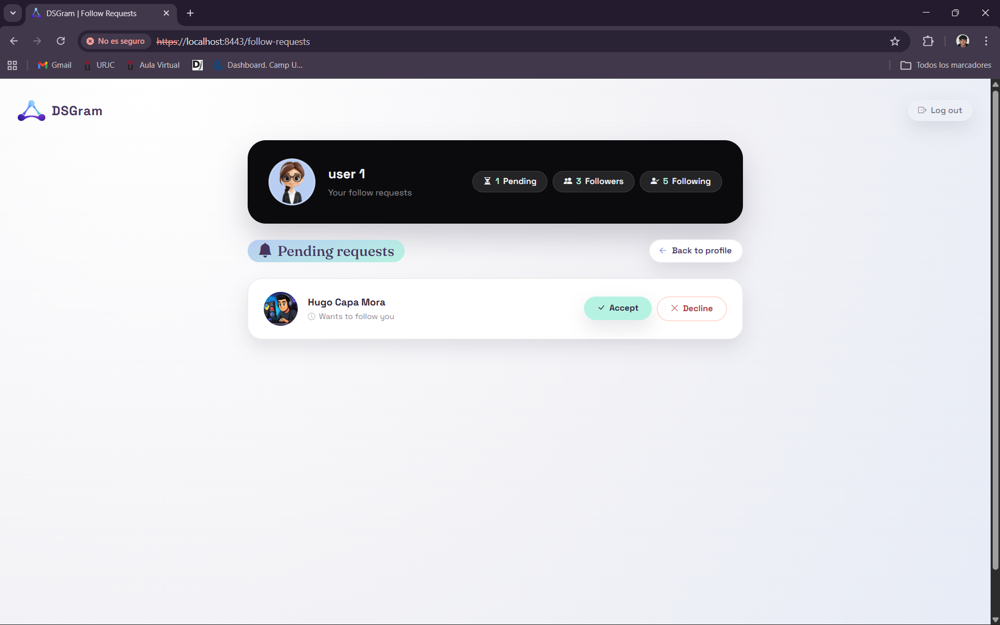
> Panel donde el usuario puede gestionar su privacidad aceptando o rechazando las peticiones de seguimiento de otras personas.

#### **10. Panel de Administración de Usuarios / Admin Panel Users**

> Herramienta exclusiva para administradores que permite gestionar, buscar y moderar las cuentas de usuario registradas en el sistema.

#### **11. Panel de Administración de Listas / Admin Panel Lists**
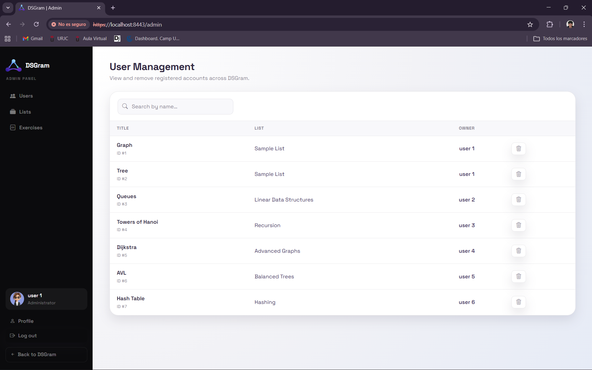
> Vista administrativa diseñada para supervisar, editar o eliminar de forma global las listas creadas por los usuarios.

#### **12. Panel de Administración de Ejercicios / Admin Panel Exercises**
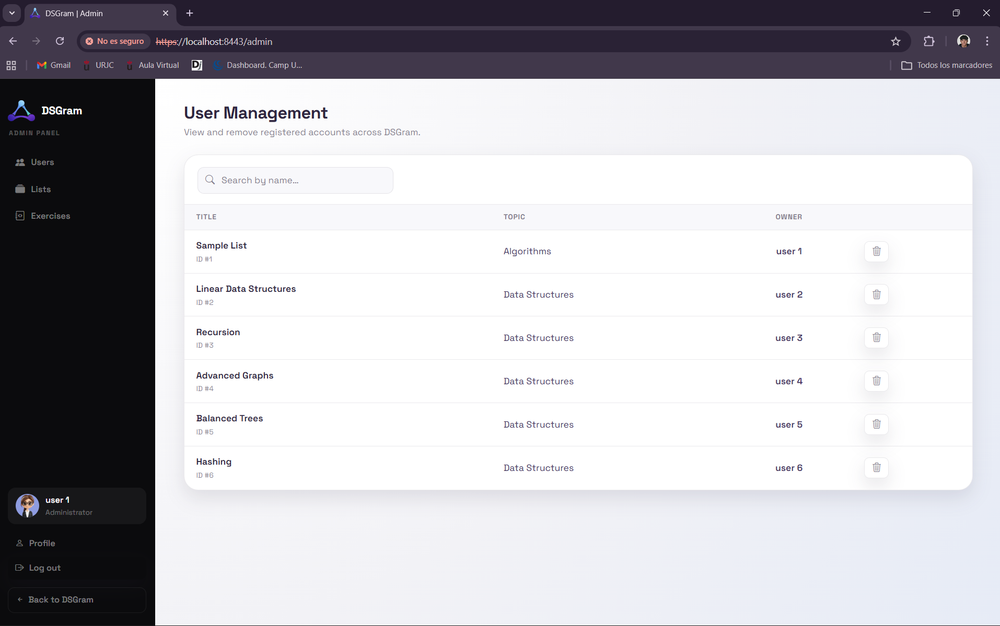
> Interfaz de administración dedicada a la moderación y control de todos los ejercicios publicados en la plataforma.

#### **13. Editar Perfil / Edit Profile**
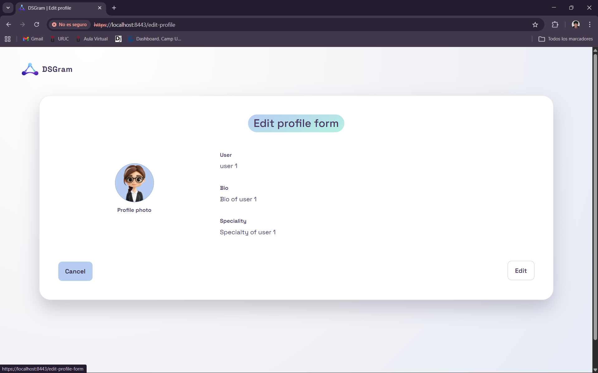
> Formulario de ajustes donde el usuario puede actualizar su foto de perfil, nombre, biografía y especialidad.

#### **14. Vista de Lista / List View**
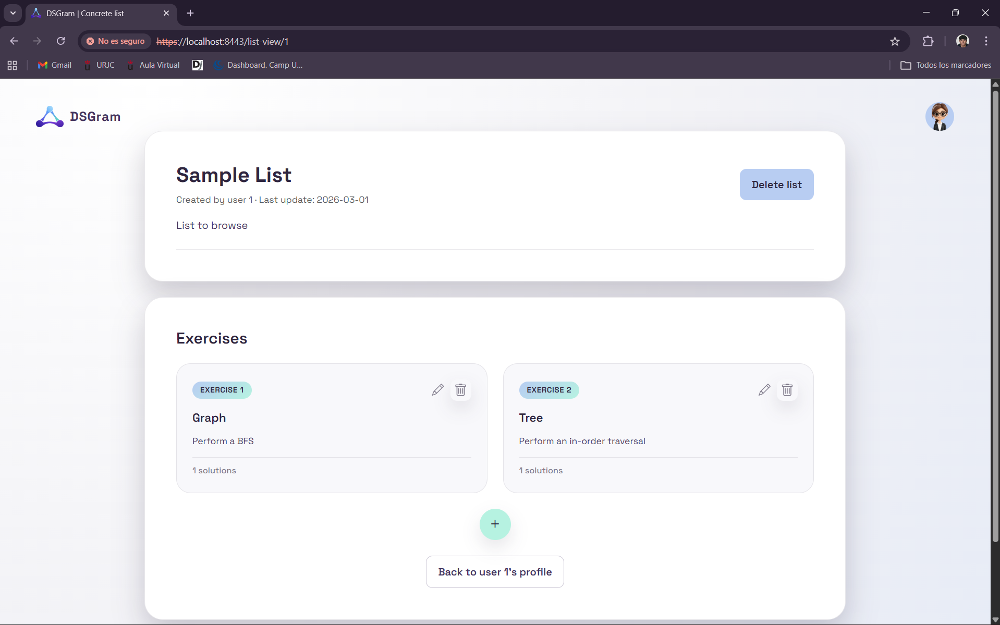
> Visualización detallada de una lista propia, mostrando todos los ejercicios que contiene y permitiendo su completa gestión.

#### **15. Editar Lista / Edit List**
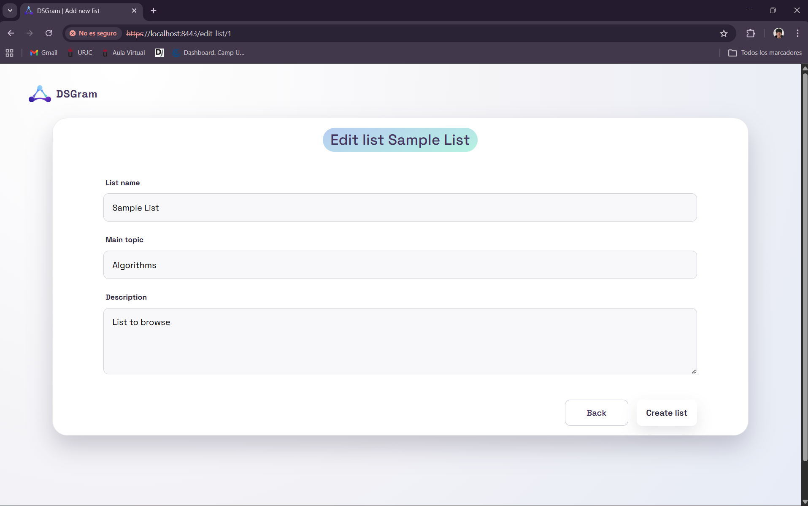
> Pantalla de edición para modificar los detalles de una lista existente, como cambiar su título o actualizar su descripción.

#### **16. Añadir Lista / Add List**
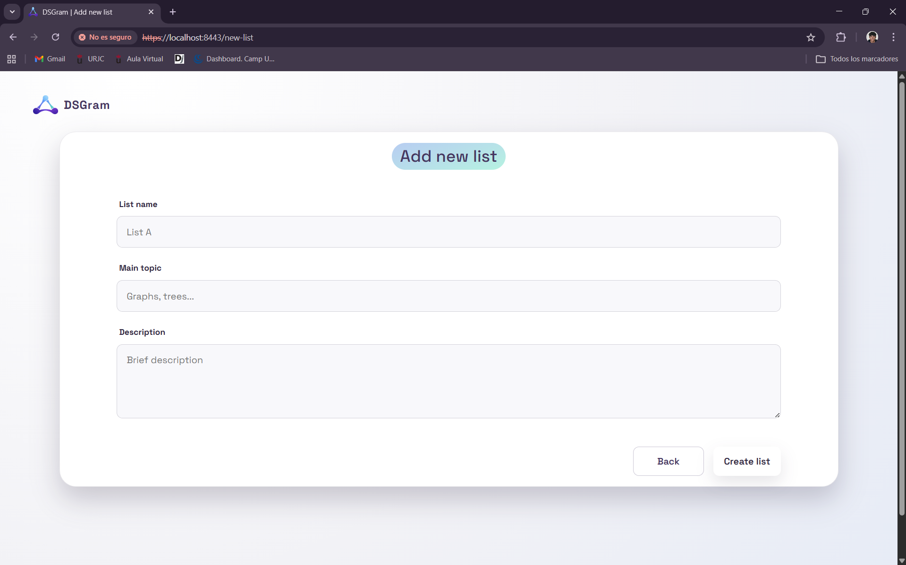
> Formulario principal para que el usuario pueda crear una nueva lista y empezar a organizar su contenido.

#### **17. Añadir Ejercicio / Add Exercise**
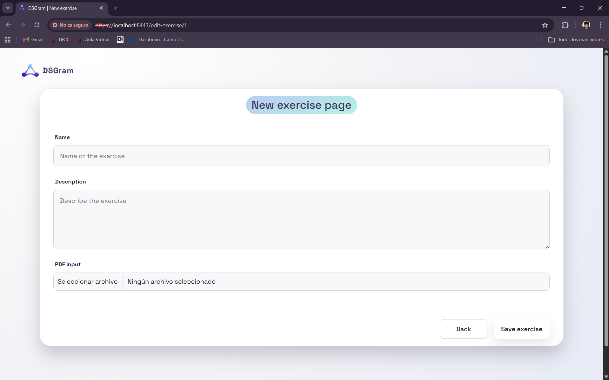
> Página que permite añadir un nuevo ejercicio a una lista, incluyendo campos para el título, descripción y la subida de un archivo PDF adjunto.

#### **18. Añadir Solución / Add Solution**

> Interfaz específica para que los usuarios puedan publicar la respuesta o resolución a un ejercicio en concreto.

#### **19. Vista de Ejercicio / Exercise View**

> Detalle completo de un ejercicio propio, donde se puede consultar el enunciado, ver el PDF asociado y gestionar las soluciones aportadas.

#### **20. Vista de Solución / Solution View**

> Página enfocada en mostrar la resolución detallada de un ejercicio para su consulta o evaluación, permitiendo su exportación a pdf.

#### **21. Añadir Comentario / Add Comment**
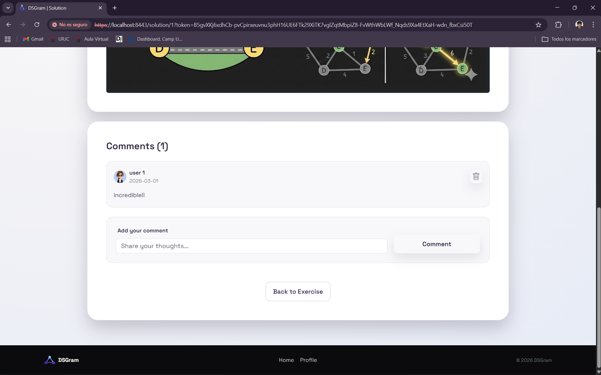
> Sección habilitada para interactuar con el contenido, permitiendo dejar feedback, valoraciones o dudas en los ejercicios y soluciones.

#### **22. Perfil de Otro Usuario / Other Profile**
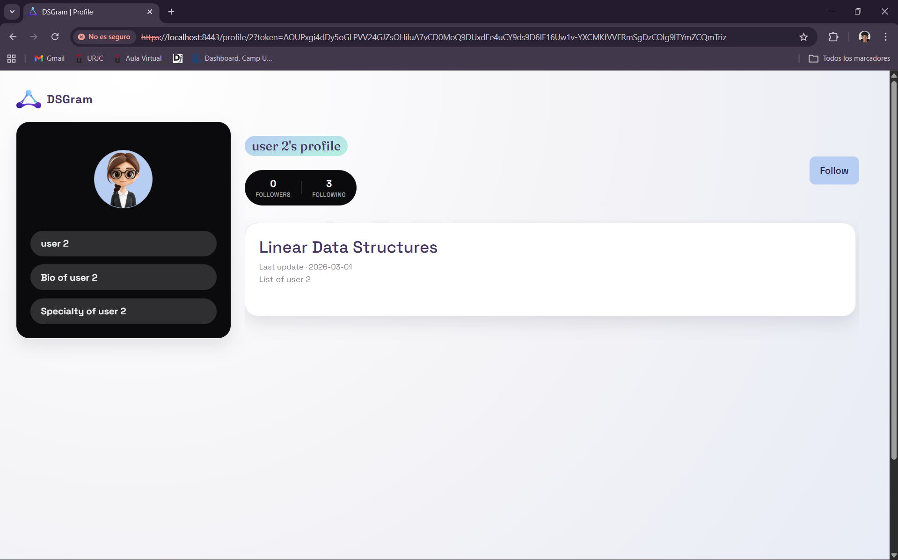
> Vista pública del perfil de un tercero, donde se pueden consultar sus listas públicas y enviarle una solicitud para seguirle.

#### **23. Vista de Lista (No Propietario) / List View Not Owner**
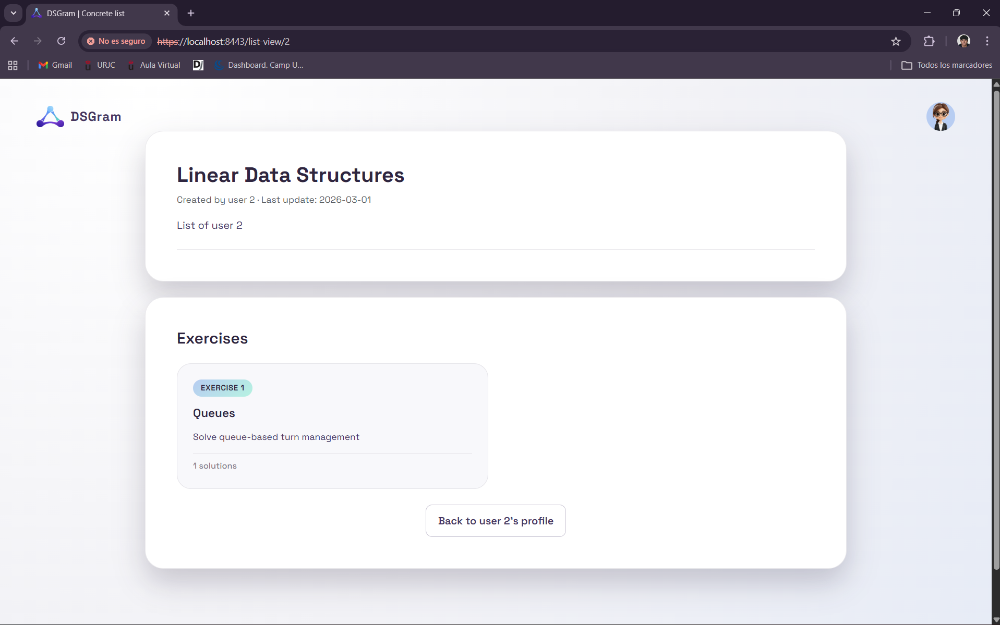
> Visualización de una lista perteneciente a otro usuario. Permite consultar el contenido organizado pero sin opciones de borrado.

#### **24. Vista de Ejercicio (No Propietario) / Exercise View Not Owner**
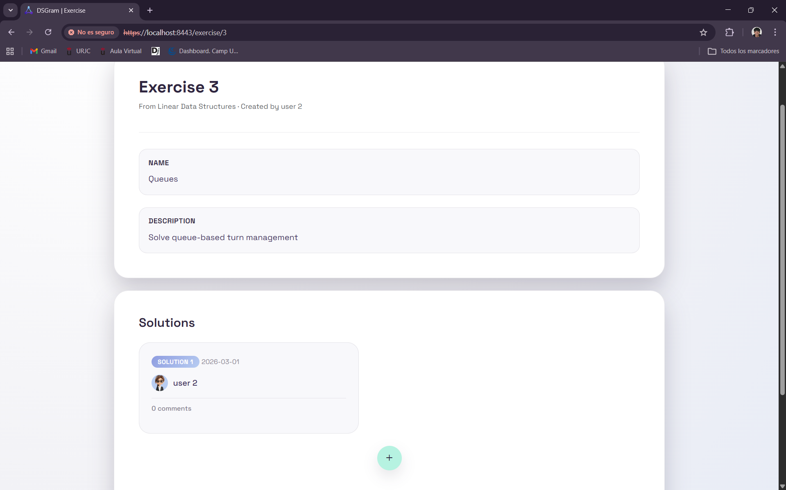
> Pantalla de un ejercicio creado por otra persona. Permite consultar el enunciado y añadir soluciones, pero no borrarlas.

### **Instrucciones de Ejecución**

#### **Requisitos Previos**
- **Java**: versión 21 o superior
- **Maven**: versión 3.8 o superior
- **MySQL**: versión 8.0 o superior
- **Git**: para clonar el repositorio

#### **Pasos para ejecutar la aplicación**

1. **Clonar el repositorio**
   ```bash
   git clone https://github.com/[usuario]/[nombre-repositorio].git
   cd [nombre-repositorio]
   ```

2. **AQUÍ INDICAR LO SIGUIENTES PASOS**

#### **Credenciales de prueba**
- **Usuario Admin**: usuario: `user1@example.com`, contraseña: `pass`
- **Usuario Registrado**: usuario: `user2@example.com`, contraseña: `pass`

### **Diagrama de Entidades de Base de Datos**

Diagrama mostrando las entidades, sus campos y relaciones:

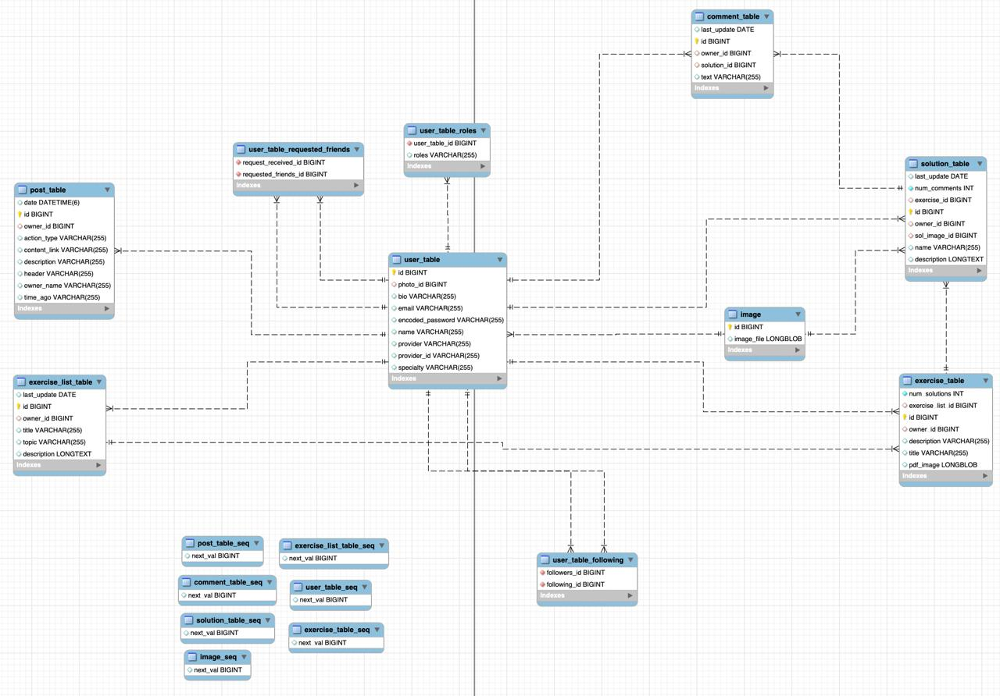

> El diagrama muestra las entidades de la aplicación

### **Diagrama de Clases y Templates**

Diagrama de clases de la aplicación con diferenciación por colores o secciones:

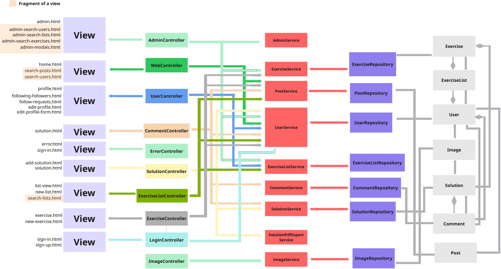

> Los controladores utilizan mútliples servicios. Cada servicio utiliza su respectivo repositorio además de otros servicios que les sean necesarios, lo cual no ha sido representado en el diagrama por simplicidad. Se utilizan también colores diferentes para cada controlador para un mejor entendimiento. Las realciones entre entidades son numerosas porque se ha implementado bidirección entre ellas.

### **Participación de Miembros en la Práctica 1**

#### **Alumno 1 - Hugo Capa Mora**

Responsable del desarrollo integral de la lógica de negocio para la gestión y vista de listas, ejercicios, soluciones y comentarios, junto con la implementación de consultas avanzadas de base de datos para el sistema de sugerencias de seguimiento y validaciones dinámicas en el frontend para optimizar la experiencia de usuario.

| Nº    | Commits      | Files      |
|:------------: |:------------:| :------------:|
|1| [feat: Advanced query algorithm in native SQL for follow-up suggestions](http://github.com/CodeURJC-DAW-2025-26/practica-daw-2025-26-grupo-15/commit/240b1232c754dfab2742bddd692051dadc4203ec)  | [UserRepository](backend/src/main/java/es/codeurjc/daw/library/repository/UserRepository.java)   |
|2| [Entities ExerciseList, Exercise, Solution, Comment (bidirectionality of cardinalities missing) & attempt to display list-view](https://github.com/CodeURJC-DAW-2025-26/practica-daw-2025-26-grupo-15/commit/1bd9b4bd0bddb631e5b7c74d0ed28cd0c2363996)  | [Exercise](backend/src/main/java/es/codeurjc/daw/library/model/Exercise.java)   |
|3| [View of solution page & Comment form with PostMapping](https://github.com/CodeURJC-DAW-2025-26/practica-daw-2025-26-grupo-15/commit/6e4495b85b32bdc9d0cd457dfad53ff18e1b8c07)  | [CommentController](backend/src/main/java/es/codeurjc/daw/library/controller/CommentController.java)   |
|4| [Correct navigation between lists, exercises, solutions, and comments](https://github.com/CodeURJC-DAW-2025-26/practica-daw-2025-26-grupo-15/commit/4f8c3fa5eae7e1486ebc92d8308c2deef4f7317d)  | [ExerciseListController](backend/src/main/java/es/codeurjc/daw/library/controller/ExerciseListController.java)   |
|5| [Functionality to add exercises to exercise lists](https://github.com/CodeURJC-DAW-2025-26/practica-daw-2025-26-grupo-15/commit/6d646dd2c2d5c6b6714003cdafcc38ebf9e91917)  | [ExerciseService](backend/src/main/java/es/codeurjc/daw/library/service/ExerciseService.java)   |

---

#### **Alumno 2 - [Nombre Completo]**

[Descripción de las tareas y responsabilidades principales del alumno en el proyecto]

| Nº    | Commits      | Files      |
|:------------: |:------------:| :------------:|
|1| [Descripción commit 1](URL_commit_1)  | [Archivo1](URL_archivo_1)   |
|2| [Descripción commit 2](URL_commit_2)  | [Archivo2](URL_archivo_2)   |
|3| [Descripción commit 3](URL_commit_3)  | [Archivo3](URL_archivo_3)   |
|4| [Descripción commit 4](URL_commit_4)  | [Archivo4](URL_archivo_4)   |
|5| [Descripción commit 5](URL_commit_5)  | [Archivo5](URL_archivo_5)   |

---

#### **Alumno 3 - Jaime Torroba Martínez**

Encargado del sistema de Posts, del sistema de scroll implementado con AJAX para los feeds así como en el panel de administración, en el que también se implementa filtrado por el nombre. Búsqueda de usuarios en la página principal y creación y edición de la entidad Exercise con la opción de adjuntar un archico PDF llevando a cabo las comprobaciones necesarias tanto en front como en back para comprobar el tipo de archivo; pudiendo además decargar el PDF adjuntado a un ejercicio ya subido.

| Nº    | Commits      | Files      |
|:------------: |:------------:| :------------:|
|1| [Add admin panel full functionalities for searching users, lists & exercises with and without filter.](https://github.com/CodeURJC-DAW-2025-26/practica-daw-2025-26-grupo-15/commit/cef1a88dbf68f819d46a31e948df66c982d988d4)  | [AdminController](backend/src/main/java/es/codeurjc/daw/library/controller/AdminController.java)   |
|2| [ Add following reflexive relation on User](https://github.com/CodeURJC-DAW-2025-26/practica-daw-2025-26-grupo-15/commit/1157bb1e6e0dbe1d925541412e2819944ed1373e)  | [feed.js](backend/src/main/resources/static/js/feed.js)   |
|3| [Add post creation on lists, exercises & comments creation & update.](https://github.com/CodeURJC-DAW-2025-26/practica-daw-2025-26-grupo-15/commit/bdcb693980bf179e9ad6d73bdb17313a9d170a22)  | [PostService](backend/src/main/java/es/codeurjc/daw/library/service/PostService.java)   |
|4| [Add edit and create exercise with pdf input check and appliance. Download pdf file from exercise.](https://github.com/CodeURJC-DAW-2025-26/practica-daw-2025-26-grupo-15/commit/c7df8009b963228ab3741234524b9f6a9777e410)  | [ExerciseService](backend/src/main/java/es/codeurjc/daw/library/service/ExerciseService.java)   |
|5| [Fix search users infinite scroll (end users search bar implementation)](https://github.com/CodeURJC-DAW-2025-26/practica-daw-2025-26-grupo-15/commit/36e48d100ff68f2254e9e19d14996f23b3711d8e)  | [home.js](backend/src/main/resources/static/js/home.js)   |

---

#### **Alumno 4 - Pablo Ruiz Uroz**

Responsable de la integración de tecnologías externas, incluyendo la implementación del sistema de autenticación mediante OAuth2 con Google y GitHub, así como la funcionalidad de exportación a PDF. Desarrollo de toda la lógica de seguridad de la aplicación: gestión de usuarios y entidades relacionadas, comprobaciones de permisos y validaciones de acceso.
Implementación de la lógica de gestión de imágenes en todas las entidades del sistema, asegurando sus correctas relaciones y funcionamiento.
Desarrollo de las funcionalidades de borrado de usuarios, creación y gestión del panel de administración, y control de la visualización de páginas accesibles para usuarios anónimos.
Control dinámico de los elementos mostrados en la interfaz según el rol del usuario y definición de la lógica de acceso en función del tipo de usuario autenticado.

| Nº    | Commits      | Files      |
|:------------: |:------------:| :------------:|
|1| [Implement OAuth2 authentication with Google and GitHub](https://github.com/CodeURJC-DAW-2025-26/practica-daw-2025-26-grupo-15/commit/c2ce9d296370937038237effdd5d12c91a92e2df)  | [OAuthUserServie](backend/src/main/java/es/codeurjc/daw/library/security/OAuthUserService.java)   |
|2| [Add user registration feature with validation and error handling](https://github.com/CodeURJC-DAW-2025-26/practica-daw-2025-26-grupo-15/commit/acdde38588b5c7e5a895fc986cfc6be79ca97a59)  | [UserService](backend/src/main/java/es/codeurjc/daw/library/service/UserService.java)   |
|3| [Admin Panel Functionality](https://github.com/CodeURJC-DAW-2025-26/practica-daw-2025-26-grupo-15/commit/fa3674a6a4a842004cbc3ed0c1422607d878ff95)  | [UserController](backend/src/main/java/es/codeurjc/daw/library/controller/UserController.java)   |
|4| [PDF Solution Export Functionality](https://github.com/CodeURJC-DAW-2025-26/practica-daw-2025-26-grupo-15/commit/aa8ccc589ed7d6dea7735d568148e0fe230d9da3)  | [SolutionPdfExportService](backend/src/main/java/es/codeurjc/daw/library/service/SolutionPdfExportService.java)   |
|5| [Login with Email Functionality](https://github.com/CodeURJC-DAW-2025-26/practica-daw-2025-26-grupo-15/commit/3344f995316134e9a665f3c1364bf095d1c249ad)  | [WebController](backend/src/main/java/es/codeurjc/daw/library/controller/WebController.java)   |

---

## 🛠 **Práctica 2: Incorporación de una API REST a la aplicación web, despliegue con Docker y despliegue remoto**

### **Vídeo de Demostración**
📹 **[Enlace al vídeo en YouTube](https://www.youtube.com/watch?v=x91MPoITQ3I)**
> Vídeo mostrando las principales funcionalidades de la aplicación web.

### **Documentación de la API REST**

#### **Especificación OpenAPI**
📄 **[Especificación OpenAPI (YAML)](/api-docs/api-docs.yaml)**

#### **Documentación HTML**
📖 **[Documentación API REST (HTML)](https://raw.githack.com/[usuario]/[repositorio]/main/api-docs/api-docs.html)**

> La documentación de la API REST se encuentra en la carpeta `/api-docs` del repositorio. Se ha generado automáticamente con SpringDoc a partir de las anotaciones en el código Java.

### **Diagrama de Clases y Templates Actualizado**

Diagrama actualizado incluyendo los @RestController y su relación con los @Service compartidos:


### **Instrucciones de Ejecución con Docker**

#### **Requisitos previos:**
- Docker instalado (versión 20.10 o superior)
- Docker Compose instalado (versión 2.0 o superior)

#### **Pasos para ejecutar con docker-compose:**

1. **Clonar el repositorio** (si no lo has hecho ya):
   ```bash
   git clone https://github.com/[usuario]/[repositorio].git
   cd [repositorio]
   ```

2. **AQUÍ LOS SIGUIENTES PASOS**:

### **Construcción de la Imagen Docker**

#### **Requisitos:**
- Docker instalado en el sistema

#### **Pasos para construir y publicar la imagen:**

1. **Navegar al directorio de Docker**:
   ```bash
   cd docker
   ```

2. **AQUÍ LOS SIGUIENTES PASOS**

### **Despliegue en Máquina Virtual**

#### **Requisitos:**
- Acceso a la máquina virtual (SSH)
- Clave privada para autenticación
- Conexión a la red correspondiente o VPN configurada

#### **Pasos para desplegar:**

1. **Conectar a la máquina virtual**:
   ```bash
   ssh -i [ruta/a/clave.key] [usuario]@[IP-o-dominio-VM]
   ```
   
   Ejemplo:
   ```bash
   ssh -i ssh-keys/app.key vmuser@10.100.139.XXX
   ```

2. **AQUÍ LOS SIGUIENTES PASOS**:

### **URL de la Aplicación Desplegada**

🌐 **URL de acceso**: `https://[nombre-app].etsii.urjc.es:8443`

#### **Credenciales de Usuarios de Ejemplo**

| Rol | Usuario | Contraseña |
|:---|:---|:---|
| Administrador | admin | admin123 |
| Usuario Registrado | user1 | user123 |
| Usuario Registrado | user2 | user123 |

### **Participación de Miembros en la Práctica 2**

#### **Alumno 1 - [Nombre Completo]**

[Descripción de las tareas y responsabilidades principales del alumno en el proyecto]

| Nº    | Commits      | Files      |
|:------------: |:------------:| :------------:|
|1| [Descripción commit 1](URL_commit_1)  | [Archivo1](URL_archivo_1)   |
|2| [Descripción commit 2](URL_commit_2)  | [Archivo2](URL_archivo_2)   |
|3| [Descripción commit 3](URL_commit_3)  | [Archivo3](URL_archivo_3)   |
|4| [Descripción commit 4](URL_commit_4)  | [Archivo4](URL_archivo_4)   |
|5| [Descripción commit 5](URL_commit_5)  | [Archivo5](URL_archivo_5)   |

---

#### **Alumno 2 - [Nombre Completo]**

[Descripción de las tareas y responsabilidades principales del alumno en el proyecto]

| Nº    | Commits      | Files      |
|:------------: |:------------:| :------------:|
|1| [Descripción commit 1](URL_commit_1)  | [Archivo1](URL_archivo_1)   |
|2| [Descripción commit 2](URL_commit_2)  | [Archivo2](URL_archivo_2)   |
|3| [Descripción commit 3](URL_commit_3)  | [Archivo3](URL_archivo_3)   |
|4| [Descripción commit 4](URL_commit_4)  | [Archivo4](URL_archivo_4)   |
|5| [Descripción commit 5](URL_commit_5)  | [Archivo5](URL_archivo_5)   |

---

#### **Alumno 3 - [Nombre Completo]**

[Descripción de las tareas y responsabilidades principales del alumno en el proyecto]

| Nº    | Commits      | Files      |
|:------------: |:------------:| :------------:|
|1| [Descripción commit 1](URL_commit_1)  | [Archivo1](URL_archivo_1)   |
|2| [Descripción commit 2](URL_commit_2)  | [Archivo2](URL_archivo_2)   |
|3| [Descripción commit 3](URL_commit_3)  | [Archivo3](URL_archivo_3)   |
|4| [Descripción commit 4](URL_commit_4)  | [Archivo4](URL_archivo_4)   |
|5| [Descripción commit 5](URL_commit_5)  | [Archivo5](URL_archivo_5)   |

---

#### **Alumno 4 - [Nombre Completo]**

[Descripción de las tareas y responsabilidades principales del alumno en el proyecto]

| Nº    | Commits      | Files      |
|:------------: |:------------:| :------------:|
|1| [Descripción commit 1](URL_commit_1)  | [Archivo1](URL_archivo_1)   |
|2| [Descripción commit 2](URL_commit_2)  | [Archivo2](URL_archivo_2)   |
|3| [Descripción commit 3](URL_commit_3)  | [Archivo3](URL_archivo_3)   |
|4| [Descripción commit 4](URL_commit_4)  | [Archivo4](URL_archivo_4)   |
|5| [Descripción commit 5](URL_commit_5)  | [Archivo5](URL_archivo_5)   |

---

## 🛠 **Práctica 3: Implementación de la web con arquitectura SPA**

### **Vídeo de Demostración**
📹 **[Enlace al vídeo en YouTube](URL_del_video)**
> Vídeo mostrando las principales funcionalidades de la aplicación web.

### **Preparación del Entorno de Desarrollo**

#### **Requisitos Previos**
- **Node.js**: versión 18.x o superior
- **npm**: versión 9.x o superior (se instala con Node.js)
- **Git**: para clonar el repositorio

#### **Pasos para configurar el entorno de desarrollo**

1. **Instalar Node.js y npm**
   
   Descarga e instala Node.js desde [https://nodejs.org/](https://nodejs.org/)
   
   Verifica la instalación:
   ```bash
   node --version
   npm --version
   ```

2. **Clonar el repositorio** (si no lo has hecho ya)
   ```bash
   git clone https://github.com/[usuario]/[nombre-repositorio].git
   cd [nombre-repositorio]
   ```

3. **Navegar a la carpeta del proyecto React**
   ```bash
   cd frontend
   ```

4. **AQUÍ LOS SIGUIENTES PASOS**

### **Diagrama de Clases y Templates de la SPA**

Diagrama mostrando los componentes React, hooks personalizados, servicios y sus relaciones:


### **Participación de Miembros en la Práctica 3**

#### **Alumno 1 - [Nombre Completo]**

[Descripción de las tareas y responsabilidades principales del alumno en el proyecto]

| Nº    | Commits      | Files      |
|:------------: |:------------:| :------------:|
|1| [Descripción commit 1](URL_commit_1)  | [Archivo1](URL_archivo_1)   |
|2| [Descripción commit 2](URL_commit_2)  | [Archivo2](URL_archivo_2)   |
|3| [Descripción commit 3](URL_commit_3)  | [Archivo3](URL_archivo_3)   |
|4| [Descripción commit 4](URL_commit_4)  | [Archivo4](URL_archivo_4)   |
|5| [Descripción commit 5](URL_commit_5)  | [Archivo5](URL_archivo_5)   |

---

#### **Alumno 2 - [Nombre Completo]**

[Descripción de las tareas y responsabilidades principales del alumno en el proyecto]

| Nº    | Commits      | Files      |
|:------------: |:------------:| :------------:|
|1| [Descripción commit 1](URL_commit_1)  | [Archivo1](URL_archivo_1)   |
|2| [Descripción commit 2](URL_commit_2)  | [Archivo2](URL_archivo_2)   |
|3| [Descripción commit 3](URL_commit_3)  | [Archivo3](URL_archivo_3)   |
|4| [Descripción commit 4](URL_commit_4)  | [Archivo4](URL_archivo_4)   |
|5| [Descripción commit 5](URL_commit_5)  | [Archivo5](URL_archivo_5)   |

---

#### **Alumno 3 - [Nombre Completo]**

[Descripción de las tareas y responsabilidades principales del alumno en el proyecto]

| Nº    | Commits      | Files      |
|:------------: |:------------:| :------------:|
|1| [Descripción commit 1](URL_commit_1)  | [Archivo1](URL_archivo_1)   |
|2| [Descripción commit 2](URL_commit_2)  | [Archivo2](URL_archivo_2)   |
|3| [Descripción commit 3](URL_commit_3)  | [Archivo3](URL_archivo_3)   |
|4| [Descripción commit 4](URL_commit_4)  | [Archivo4](URL_archivo_4)   |
|5| [Descripción commit 5](URL_commit_5)  | [Archivo5](URL_archivo_5)   |

---

#### **Alumno 4 - [Nombre Completo]**

[Descripción de las tareas y responsabilidades principales del alumno en el proyecto]

| Nº    | Commits      | Files      |
|:------------: |:------------:| :------------:|
|1| [Descripción commit 1](URL_commit_1)  | [Archivo1](URL_archivo_1)   |
|2| [Descripción commit 2](URL_commit_2)  | [Archivo2](URL_archivo_2)   |
|3| [Descripción commit 3](URL_commit_3)  | [Archivo3](URL_archivo_3)   |
|4| [Descripción commit 4](URL_commit_4)  | [Archivo4](URL_archivo_4)   |
|5| [Descripción commit 5](URL_commit_5)  | [Archivo5](URL_archivo_5)   |

